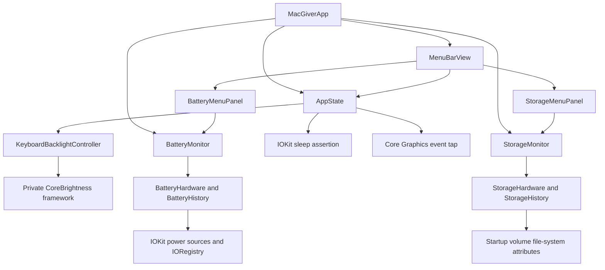

# Architecture and source map

[Documentation index](README.md) · [Development and verification](development.md)

MacGiver is a single native application with a SwiftUI `MenuBarExtra` window. It has no public HTTP API, standalone CLI, database, or application-level configuration file. Build configuration lives in [project.yml](../project.yml).

## Components and data flow



| Source | Responsibility |
| --- | --- |
| [MacGiverApp.swift](../Sources/MacGiver/MacGiverApp.swift) | Owns app-lifetime state, battery monitoring, and storage monitoring; injects them into the menu bar UI. |
| [MenuBarView.swift](../Sources/MacGiver/MenuBarView.swift) | Utility switches, compact/expanded presentation, one-second visible-panel brightness refresh, and quit action. |
| [AppState.swift](../Sources/MacGiver/AppState.swift) | Main-actor published utility state, menu symbol, idle-sleep assertion, keyboard event tap, and backlight errors. |
| [KeyboardBacklight.swift](../Sources/MacGiver/KeyboardBacklight.swift) | Brightness restoration and verified writes through a runtime-loaded CoreBrightness adapter. |
| [BatteryReading.swift](../Sources/MacGiver/BatteryReading.swift) | Hardware reads, battery value decoding, availability states, and bounded chart history. |
| [BatteryMonitor.swift](../Sources/MacGiver/BatteryMonitor.swift) | Five-second sampling, wake notifications, and in-memory history. |
| [BatteryMenuPanel.swift](../Sources/MacGiver/BatteryMenuPanel.swift) | Battery summary, metrics, and charts. |
| [StorageReading.swift](../Sources/MacGiver/StorageReading.swift) | Startup-disk capacity decoding, regional byte formatting, and bounded usage history. |
| [StorageMonitor.swift](../Sources/MacGiver/StorageMonitor.swift) | Five-second storage sampling, wake notifications, and in-memory history. |
| [StorageMenuPanel.swift](../Sources/MacGiver/StorageMenuPanel.swift) | Storage summary, capacity metrics, and usage chart. |
| [Localizable.xcstrings](../Resources/Localizable.xcstrings) | English source strings, Portuguese and Spanish translations, plural forms, tooltips, and accessibility descriptions. |

## Localization

The app uses native bundle language selection with English as its development language. SwiftUI labels use `LocalizedStringKey`; model and error messages use `String(localized:)`. Battery state identifiers, storage labels, and hardware property names stay independent of translated display text. Numbers use Foundation's regional formatting, preserving the 0–100 percentage scale, signed battery power, and byte units.

To add or change text, build in Xcode to extract localizable strings, then update all three languages in the string catalog. Xcode compiles it into `.lproj` resources; regenerate the project with XcodeGen after adding resources. `LocalizationTests.swift` checks the compiled tables directly so English fallback cannot hide missing translations.

Run the test suite with `-testLanguage en -testRegion US`, `-testLanguage pt -testRegion BR`, and `-testLanguage es -testRegion ES` to exercise native language selection in fresh app processes. Inspect compact and expanded layouts, unavailable states, errors, plural counts, tooltips, and VoiceOver labels in each language. Language changes take effect after relaunch.

## Utility state

Keep Awake creates an IOKit `PreventUserIdleSystemSleep` assertion and releases it on disable or cleanup. It does not create a display-sleep assertion.

Lock Keyboard requires Accessibility trust and installs a session event tap for key-down, key-up, and modifier-change events. Mouse events are outside the subscribed mask. A disabled event tap is re-enabled when macOS reports a timeout or user-input disable event.

Backlight state distinguishes **on**, **off**, and **unavailable**. The controller validates finite brightness values in the range `0...1`, saves the latest brightness before turning it off, and uses `0.5` only when no restore value exists. An accepted write is followed by readback attempts for up to approximately 500 ms.

The CoreBrightness adapter validates Objective-C method signatures, finds the built-in keyboard ID, and reads/writes `KeyboardBacklightBrightness`. Private API availability is checked at runtime; unsupported interfaces produce an unavailable state.

## Battery decoding and history

Mac readings combine IOKit power-source descriptions with `AppleSmartBattery` properties. The decoder separates charge state from current direction, handles signed current representations, and derives battery watts from current and voltage.

Health compares available nominal/raw capacity with design capacity. Normalized charge percentages are not used as full-charge capacity. Missing, invalid, or sentinel values remain unavailable.

History retains at most six hours and 4,321 samples. Chart series break after wake notifications, sampling gaps longer than 20 seconds, or missing measurements. Samples are kept only in memory.

## Storage decoding and history

Storage reads use `FileManager` file-system attributes for `/`, specifically the system-reported total and free byte counts. A reading is available only when both values are valid, non-negative, and free space does not exceed total capacity. Used space and percentage are derived from those values; the app does not inspect individual files.

Storage history follows the same six-hour, 4,321-sample in-memory bound as battery history. Its chart breaks after wake notifications, sampling gaps longer than 20 seconds, or unavailable readings.

## Repository layout

```text
MacGiver.xcodeproj/       Generated Xcode project and shared scheme
Sources/MacGiver/         Application and system integrations
Tests/MacGiverTests/      XCTest suites
Resources/               Application resources
docs/                    Usage, development, and architecture guides
project.yml              XcodeGen specification
CHANGELOG.md             Documented change history
LICENSE                  MIT license
```

There are no additional package dependencies for the main app.
