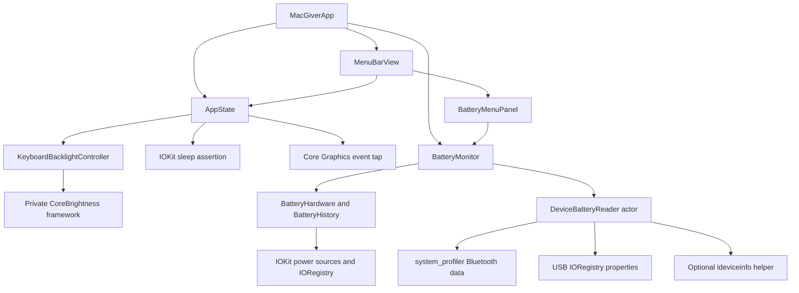

# Architecture and source map

[Documentation index](README.md) · [Development and verification](development.md)

MacGiver is a single native application with a SwiftUI `MenuBarExtra` window. It has no public HTTP API, standalone CLI, database, or application-level configuration file. Build configuration lives in [project.yml](../project.yml).

## Components and data flow



| Source | Responsibility |
| --- | --- |
| [MacGiverApp.swift](../Sources/MacGiver/MacGiverApp.swift) | Owns app-lifetime state and the battery monitor; injects both into the menu bar UI. |
| [MenuBarView.swift](../Sources/MacGiver/MenuBarView.swift) | Utility switches, compact/expanded presentation, one-second visible-panel brightness refresh, and quit action. |
| [AppState.swift](../Sources/MacGiver/AppState.swift) | Main-actor published utility state, menu symbol, idle-sleep assertion, keyboard event tap, and backlight errors. |
| [KeyboardBacklight.swift](../Sources/MacGiver/KeyboardBacklight.swift) | Brightness restoration and verified writes through a runtime-loaded CoreBrightness adapter. |
| [BatteryReading.swift](../Sources/MacGiver/BatteryReading.swift) | Hardware reads, battery value decoding, availability states, and bounded chart history. |
| [BatteryMonitor.swift](../Sources/MacGiver/BatteryMonitor.swift) | Five-second sampling, wake notifications, in-memory history, and asynchronous device scans. |
| [BatteryMenuPanel.swift](../Sources/MacGiver/BatteryMenuPanel.swift) | Summary, metrics, charts, connected devices, and device help. |
| [DeviceBatteryReader.swift](../Sources/MacGiver/DeviceBatteryReader.swift) | Bluetooth/USB discovery, optional iOS queries, and bounded subprocess execution. |

## Utility state

Keep Awake creates an IOKit `PreventUserIdleSystemSleep` assertion and releases it on disable or cleanup. It does not create a display-sleep assertion.

Lock Keyboard requires Accessibility trust and installs a session event tap for key-down, key-up, and modifier-change events. Mouse events are outside the subscribed mask. A disabled event tap is re-enabled when macOS reports a timeout or user-input disable event.

Backlight state distinguishes **on**, **off**, and **unavailable**. The controller validates finite brightness values in the range `0...1`, saves the latest brightness before turning it off, and uses `0.5` only when no restore value exists. An accepted write is followed by readback attempts for up to approximately 500 ms.

The CoreBrightness adapter validates Objective-C method signatures, finds the built-in keyboard ID, and reads/writes `KeyboardBacklightBrightness`. Private API availability is checked at runtime; unsupported interfaces produce an unavailable state.

## Battery decoding and history

Mac readings combine IOKit power-source descriptions with `AppleSmartBattery` properties. The decoder separates charge state from current direction, handles signed current representations, and derives battery watts from current and voltage.

Health compares available nominal/raw capacity with design capacity. Normalized charge percentages are not used as full-charge capacity. Missing, invalid, or sentinel values remain unavailable.

History retains at most six hours and 4,321 samples. Chart series break after wake notifications, sampling gaps longer than 20 seconds, or missing measurements. Samples are kept only in memory.

## Connected-device queries

`DeviceBatteryReader` is an actor. The monitor prevents overlapping scans. The expanded battery view triggers scans on opening and at 60-second intervals while visible.

| Source | Query and limits |
| --- | --- |
| Bluetooth | `/usr/sbin/system_profiler SPBluetoothDataType -json -detailLevel mini`; 12-second timeout; reads only connected entries. |
| USB accessories | `IOHIDDevice` properties with USB transport and a published `BatteryPercent`. |
| iPhone/iPad discovery | `IOUSBHostDevice` product name and serial number. |
| iPhone/iPad readings | `ideviceinfo -s -u <UDID> -q com.apple.mobile.battery -x`; four-second timeout per device. |

The helper is searched only in `/opt/homebrew/bin` and `/usr/local/bin`. It is optional and is not installed automatically.

`BatteryCommand` launches executables directly without a shell, drains standard output without blocking, discards standard error, and limits output to 2,000,000 bytes. Timeout, cancellation, launch failure, nonzero exit, and oversized output return no result. Its deadline also applies when a descendant process holds the output pipe open.

## Repository layout

```text
MacGiver.xcodeproj/       Generated Xcode project and shared scheme
Sources/MacGiver/         Application and system integrations
Tests/MacGiverTests/      XCTest suites
Resources/               Application resources
docs/                    Usage, development, and architecture guides
project.yml              XcodeGen specification
CHANGELOG.md             Documented change history
LICENSE                  MIT license
```

There are no additional package dependencies for the main app. The optional device helper is an external executable, not a linked application dependency.
